# CarStock_Java
Projeto sobre um sistema integrado de controle de estoque de peças automotivas e ordens de serviço para uma oficina mecânica em Java e MySQL executado na faculdade de engenharia de software, com mais 3 colegas de classe, no terceiro semetres (na data de 1 semetre de 2024)
Abaixo vou demonstrar um pouco das telas e seus funcionamentos.

***
# Tela de login
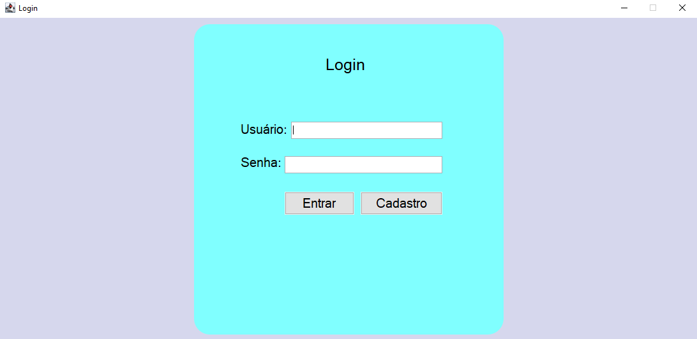

Aqui temos a tela de login que o usuário precisa inserir seu login e sua senha, caso não esteja registrado, esse usuário não pode logar.

# Tela de Cadastro de Usuário
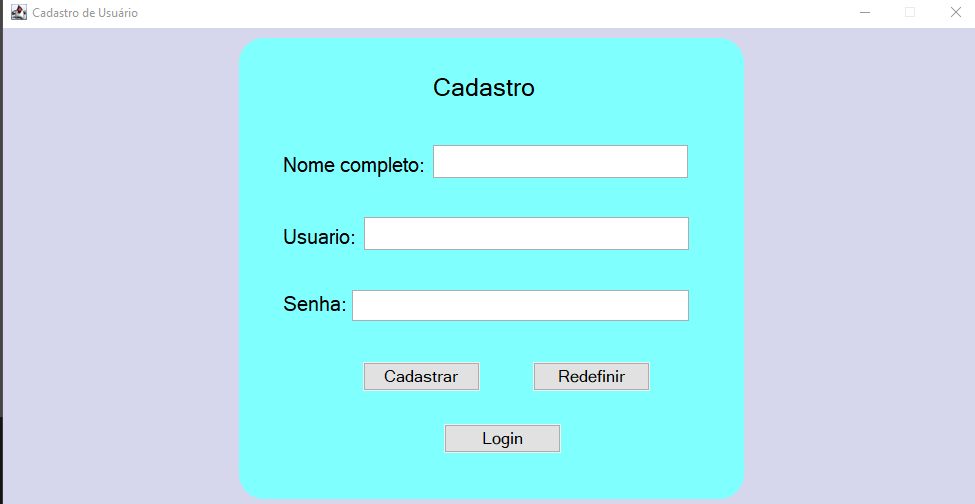

Tela onde o usuário pode se registrar.

# Tela Principal
Essa tela o usuário vai selecionar a opção que deseja trabalhar.
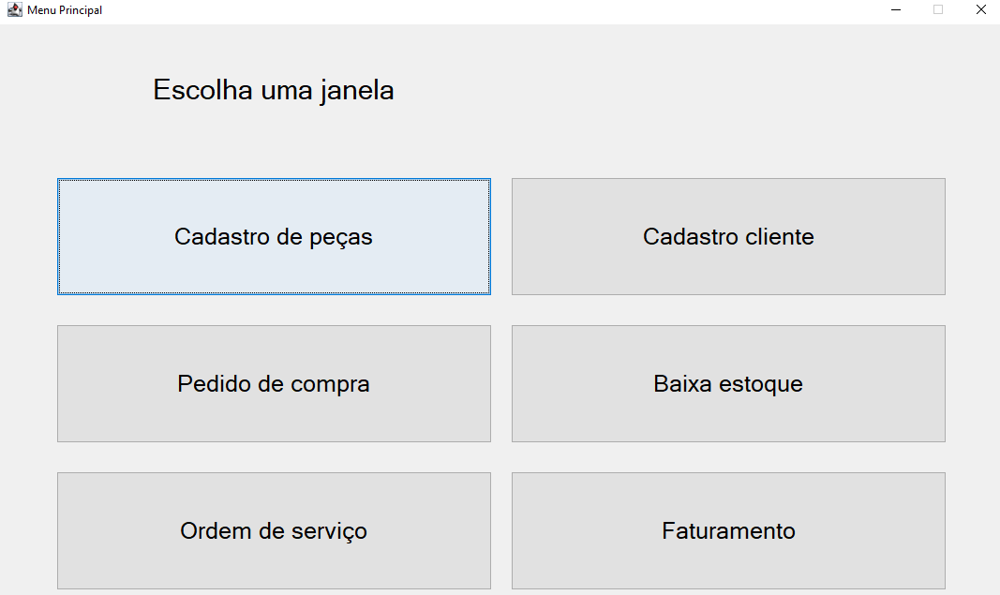

Cada botão manda para uma outra tela respectivamente, com suas próprias funções

# Tela Cadastro de Peças
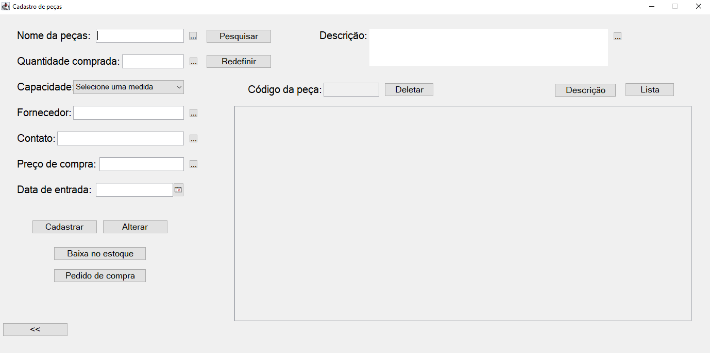

Nessa tela o usuário pode registrar uma peça com uma diversidade de informações e uma tabela para verificar outras peças. Existe um botão para ver as pesças listadas que já tiveram baixa ou não.

# Tela de Lista de Peças
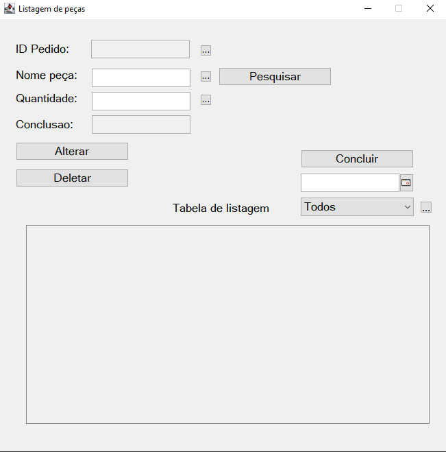

Tela para verificar quais peças já tiveram baixas no sistema

# Tela Cadastro de Clientes
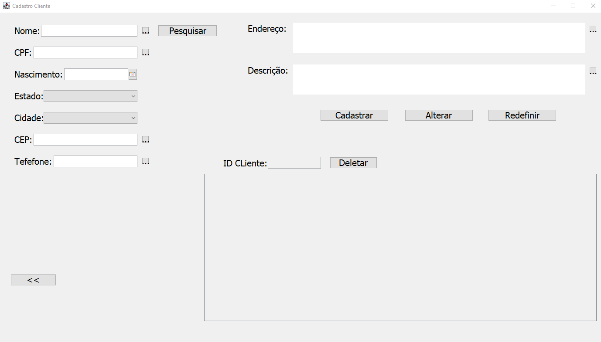

Aqui é possível cadastrar o cliente com diversas informações sobre e uma tabela para verificar outros clientes.

# Tela Pedido de Compras
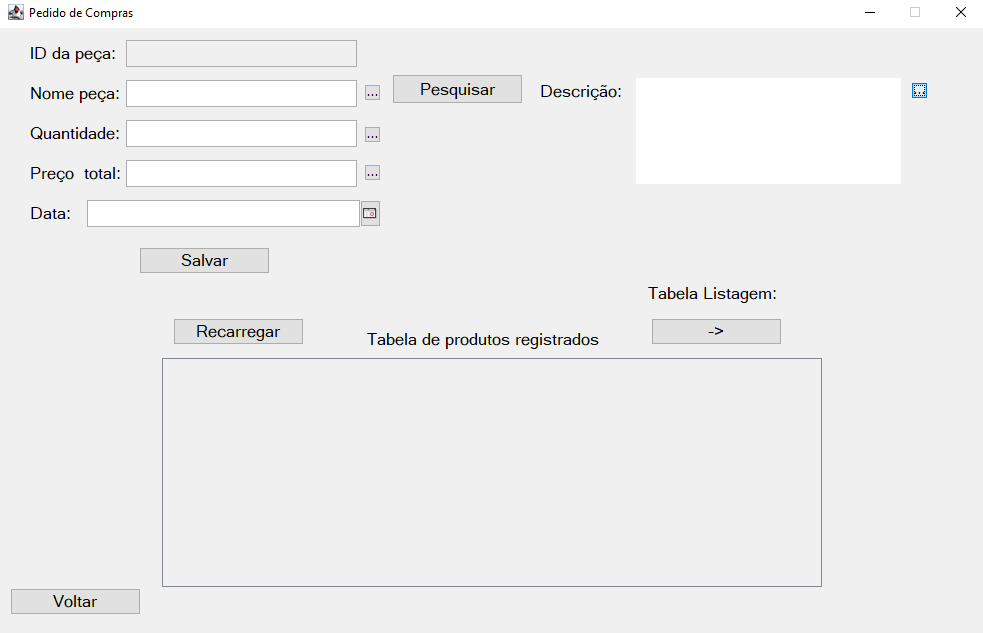

Pedido de compras, é possível o usuário através das peças já registradas, fazer um pedido de compra. Existe uma tabela com produtos já registrados para facilitar.

# Tela Baixa Estoque
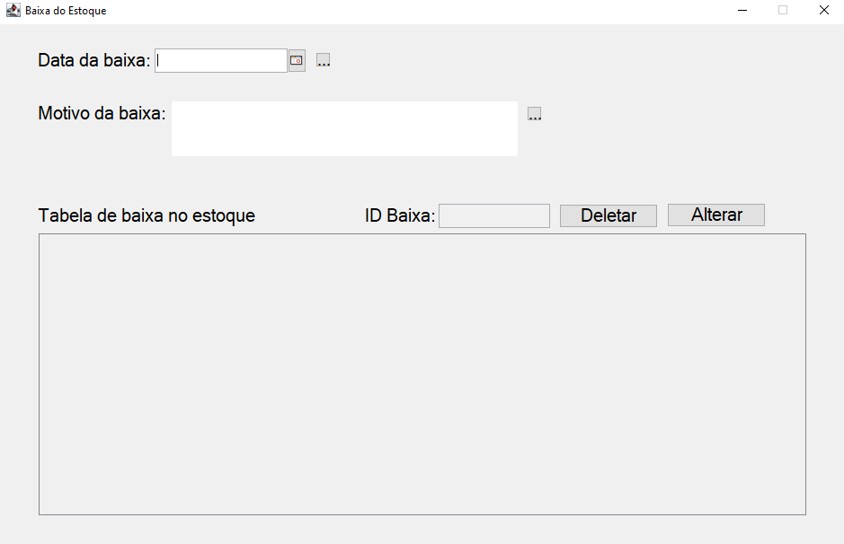

É possível dar baixa nos itens do estoaque, existe uma tabela de itens que já tiveram baixa.

# Tela Consulta Estoque
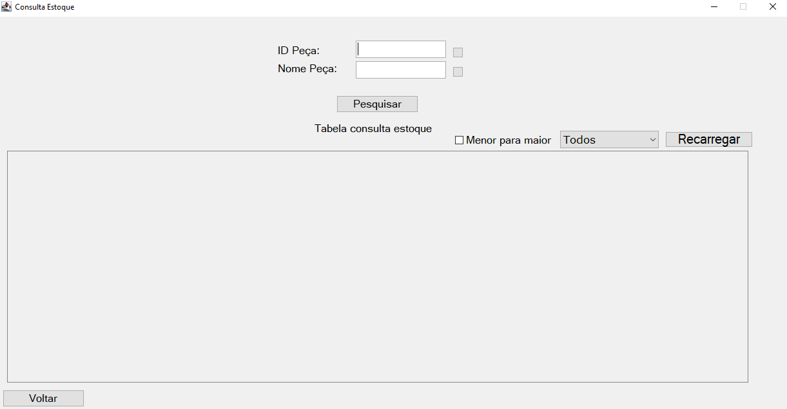

Aqui é possível verificar cada quantidade de um produto, através do nome ou do id do produto.

# Tela Ordem de Serviço
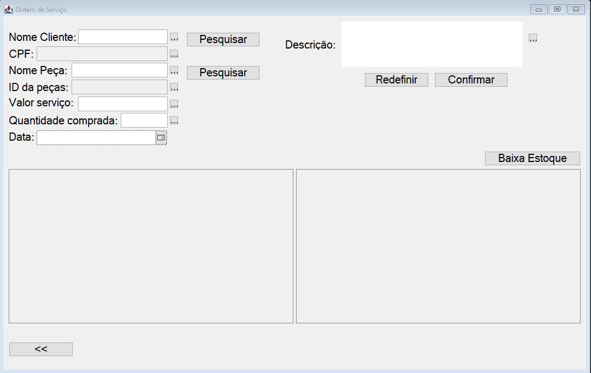

Nessa tela é possível fazer uma ordem de serviço. Existe um botão que já manda para a tela de baixa de estoque.

# Tela Controle de Faturamento
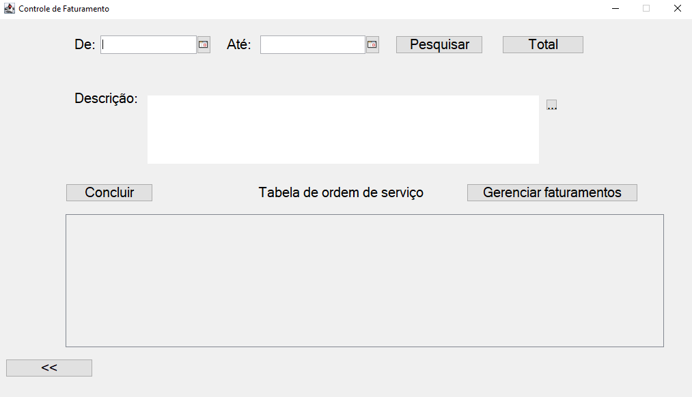

É possível fazer e registrar faturamentos. Existe um botão para gerenciar/editar faturamentos

# Tela Gerenciamento de Faturamentos
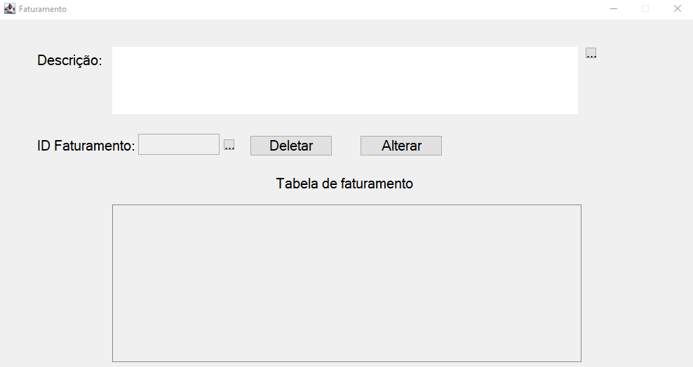

Aqui podemos adicionar uma nova descrição ao faturamento por ID, ou deletar um se necessário. Existe uma tabela para facilitar a procura de outros faturamentos.

## Obrigado por acompanhar o trabalho meu e dos demais integrante.
